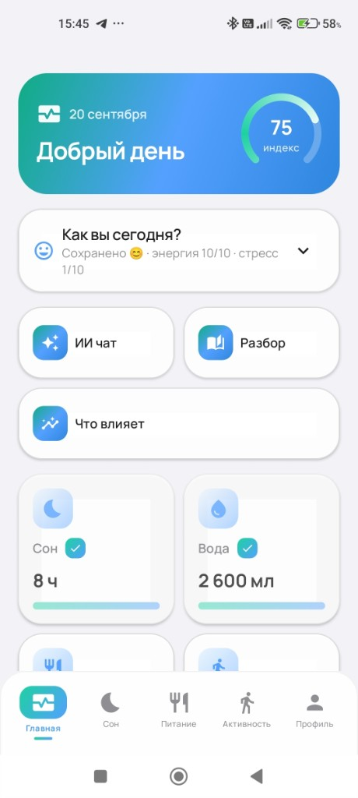
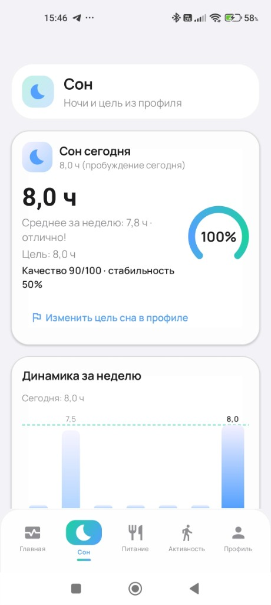
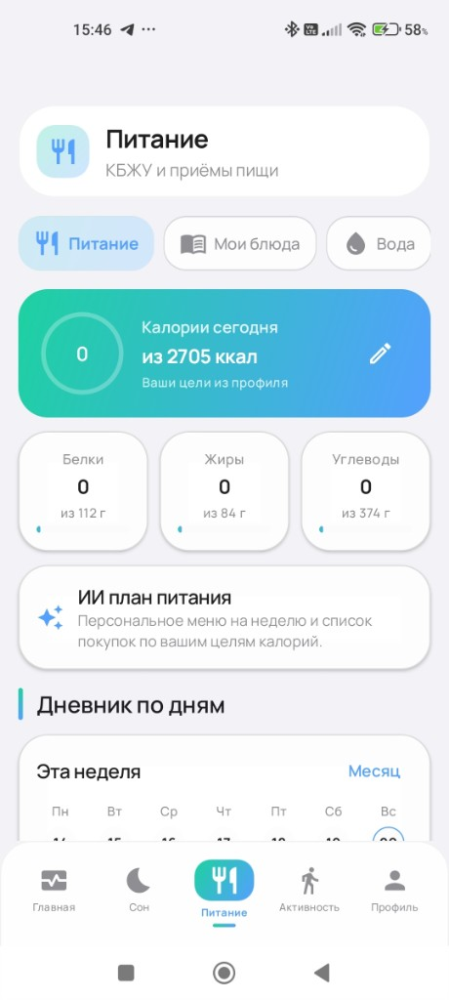
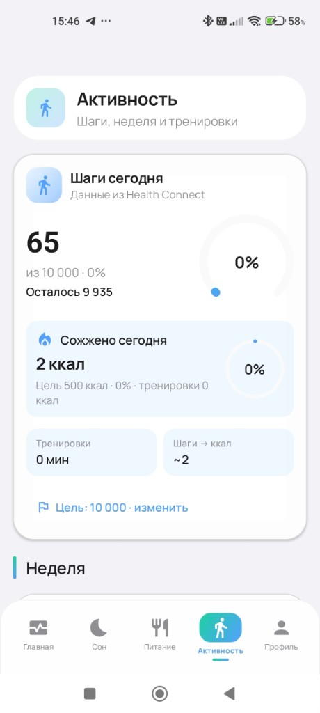
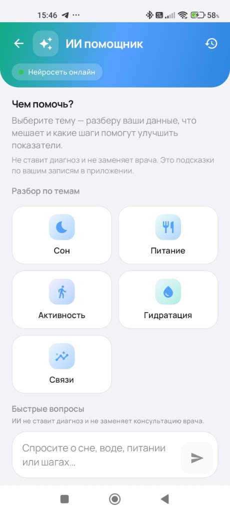
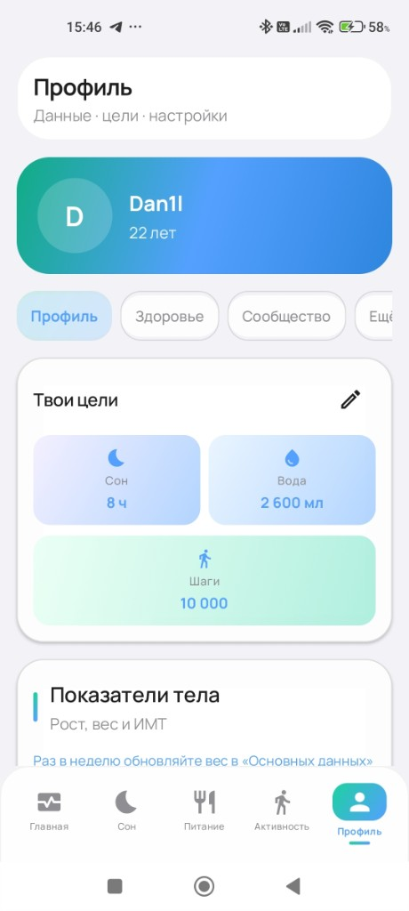

# HealthApp

Мобильный дневник здоровья: сон, вода, питание, активность и сводка дня в одном Android-приложении. Сервер на FastAPI хранит записи, считает аналитику и отвечает в ИИ-чате только по данным дневника.

Это рабочий прототип, не медицинское изделие. Подсказки не заменяют врача.

Сайт проекта: [s1nuso1d.github.io/HealthApp](https://s1nuso1d.github.io/HealthApp/) · [health-app.ru](https://health-app.ru)

## Экраны

<table>
  <tr>
    <td align="center" width="33%"><br><b>Главная</b><br>индекс дня, сон, вода, еда и шаги</td>
    <td align="center" width="33%"><br><b>Сон</b><br>ночь, качество и недельный график</td>
    <td align="center" width="33%"><br><b>Питание</b><br>калории, приёмы пищи и свои блюда</td>
  </tr>
  <tr>
    <td align="center"><br><b>Активность</b><br>шаги и тренировка с картой</td>
    <td align="center"><br><b>ИИ-помощник</b><br>разбор сна, еды, воды и нагрузки</td>
    <td align="center"><br><b>Профиль</b><br>цели, аккаунт и настройки</td>
  </tr>
</table>

## Что уже есть

- 📱 Клиент на Kotlin и Jetpack Compose: дневники, сводка дня, цели, напоминания
- ⚙️ Сервер на FastAPI: JWT, REST, WebSocket, PostgreSQL или SQLite
- 🧠 ИИ-чат по записям пользователя. Без диагнозов и назначений
- 🔄 Офлайн-очередь на телефоне и отправка на сервер, когда появляется сеть
- 🍽️ Каталог продуктов, Open Food Facts и FatSecret
- 🧪 Тесты backend, линтер и сборка Android в GitHub Actions

## Стек

| Часть | Технологии |
| --- | --- |
| Клиент | Kotlin, Jetpack Compose, Android 8.0+ |
| Сервер | Python 3.12, FastAPI, PostgreSQL, Alembic, Docker |
| Проверки | pytest, Ruff, Gradle |

## Как запустить сервер

Нужны Python 3.12 и Git. Для первого запуска хватает SQLite: отдельная база не нужна, Swagger открывается локально.

```powershell
cd HealthApp-back/backend
python -m venv .venv
.\.venv\Scripts\Activate.ps1
pip install -r requirements.txt
copy .env.example .env
uvicorn app.main:app --host 127.0.0.1 --port 8001 --reload
```

После старта:

- API: http://127.0.0.1:8001
- Swagger: http://127.0.0.1:8001/docs
- Проверка: http://127.0.0.1:8001/healthz

Если почта в `.env` не настроена, код подтверждения регистрации печатается в консоль. ИИ-чат локально ходит в [Ollama](https://ollama.com). Чтобы поднять API без модели, в `.env` поставьте `LLM_ENABLED=false`.

На macOS и Linux активация окружения такая: `source .venv/bin/activate`, файл окружения копируется командой `cp .env.example .env`.

## Как запустить в Docker

Нужны Docker и Docker Compose. Поднимаются PostgreSQL 16 и API. В этом режиме схема накатывается через Alembic, а Swagger скрыт: сервер стартует как production.

```powershell
cd HealthApp-back
New-Item -ItemType File -Name .env.compose -Force | Out-Null
$env:SECRET_KEY = python -c "import secrets; print(secrets.token_urlsafe(48))"
docker compose up --build
```

API будет на http://127.0.0.1:8001 , проверка — http://127.0.0.1:8001/healthz . Ключ `SECRET_KEY` нужен длиннее 32 символов. Файл `.env.compose` можно оставить пустым: адрес базы и режим compose подставляет сам.

## Как запустить Android

Нужны Android Studio, JDK 17 и Android SDK.

```powershell
cd HealtApp-front
copy local.properties.example local.properties
```

В `local.properties` укажите свой `sdk.dir`. Адрес API в примере уже смотрит на компьютер с эмулятора: `http://10.0.2.2:8001/`. Сначала запустите сервер, затем откройте папку `HealtApp-front` в Android Studio и нажмите Run.

Телефон по USB видит не `10.0.2.2`, а адрес компьютера в локальной сети, например `http://192.168.0.10:8001/`. Этот адрес нужно вписать в `API_BASE_URL`.

## Тесты

```powershell
cd HealthApp-back/backend
.\.venv\Scripts\Activate.ps1
python -m pytest
```

Те же проверки, плюс линтер и сборка Android, запускаются в GitHub Actions на каждый push в `main`.

## Структура

```text
HealtApp-front/     Android-клиент
HealthApp-back/     FastAPI, Docker Compose, тесты
docs/               публичный сайт и скриншоты
```
